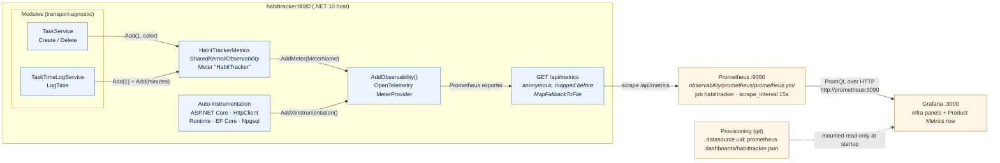

# Observability: .NET → OpenTelemetry → Prometheus → Grafana

Goal: automatic infra telemetry (ASP.NET Core, HTTP client, EF Core, .NET runtime) plus
custom HabitTracker business metrics, scraped by Prometheus and visualized in Grafana.

## Decisions taken up front

- **Exporter:** Prometheus scrape endpoint (`OpenTelemetry.Exporter.Prometheus.AspNetCore`)
  exposed at `/api/metrics` on the host. No OTel Collector — fewest moving parts.
- **Custom metrics site:** inside the Tasks module (`TaskService` / `TaskTimeLogService`),
  via a `HabitTrackerMetrics` singleton in `HabitTracker.SharedKernel`. Modules stay
  transport-agnostic — `System.Diagnostics.Metrics` only, no ASP.NET reference (ADR-0007).
- **`/api/metrics` auth:** anonymous. It is only reachable from the compose network in a
  real deployment; called out as a local-dev tradeoff in the README.
- **Traces:** out of scope for this 2h block. Metrics only. (Instrumentation packages
  bring tracing along; we just don't wire an exporter for it.)

## Flow

Naming note: dotted OTel instrument names (`habittracker.tasks.created`) are exported as
`habittracker_tasks_created_total` — write dots in C#, underscores in PromQL.

## Steps

| # | File | Budget | Outcome |
|---|------|--------|---------|
| 1 | [01-otel-dotnet.md](01-otel-dotnet.md) | 0:00–0:20 | OTel wired in the host, `/api/metrics` serves text |
| 2 | [02-prometheus.md](02-prometheus.md) | 0:20–0:45 | Prometheus container scrapes the app |
| 3 | [03-grafana.md](03-grafana.md) | 0:45–1:15 | Grafana + provisioned datasource + infra dashboard |
| 4 | [04-custom-metrics.md](04-custom-metrics.md) | 1:15–1:40 | 5 business counters + Product Metrics panels |
| 5 | [05-readme-cleanup.md](05-readme-cleanup.md) | 1:40–2:00 | README section, screenshot, ADR, final verify |

Work them in order — each assumes the previous one is green.

## Definition of done for the whole block

- `docker compose up` brings up app + postgres + prometheus + grafana.
- Prometheus `/targets` shows `habittracker` **UP**.
- Grafana has one dashboard with infra panels *and* a Product Metrics row, provisioned
  from a file in the repo (not clicked in and lost).
- `dotnet build` and `dotnet test` pass.
- README has an `## Observability` section with a dashboard screenshot.
