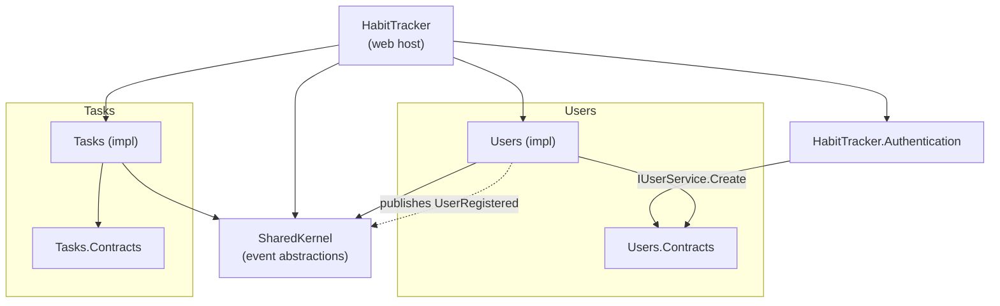

# Architecture

HabitTracker is a habit/task tracking service built as a **modular monolith**: a single
ASP.NET Core deployable (`HabitTracker`) whose internals are split into self-contained
business modules. Each module owns its domain, application logic, and persistence (its own
Postgres schema), and exposes a narrow public surface through a separate `*.Contracts`
project. The host composes the modules at startup; nothing else couples them. Targets
**.NET 10**.

## Module inventory

| Module | Responsibility | Public surface | Persists? |
|--------|----------------|----------------|-----------|
| **Users** | Identity provisioned from OIDC login: register-on-first-login, update-on-subsequent-login. | `IUserService`, `UserDto`, `UserId`, `UserRegistered` event | Yes — `users` schema |
| **Tasks** | Per-owner task list (create, list, rename, delete) plus manual time logging against a task for a given date. | `ITaskService`, `ITaskTimeLogService`, `TaskDto`, `TimeLogDto`, `TaskId`, `TimeLogId` | Yes — `tasks` schema |

Supporting (non-module) projects:

| Project | Role |
|---------|------|
| **HabitTracker** | Web host. Composes modules in `Program.cs`, owns endpoints, implements the domain-event dispatcher. |
| **HabitTracker.Authentication** | OIDC + cookie auth. Maps login claims to `IUserService.Create`. References `Users.Contracts` only. |
| **HabitTracker.SharedKernel** | The domain-event abstractions (`IDomainEvent`, `IDomainEventHandler<T>`, `IDomainEventDispatcher`). Nothing else. |
| **HabitTracker.IntegrationTests** | Integration test project. |

## Dependency rules

These are the constraints that keep the monolith modular. Treat a change to them as a
deliberate, reviewed decision — see [ADRs](adr/).

1. **Modules never reference each other's implementation.** A module project may reference
   only its own `*.Contracts` project and `SharedKernel`.
2. **Cross-module communication goes through Contracts or domain events** — interface-to-interface,
   never type-to-internal-type. See [integration contracts](integrations/).
3. **Only `*.Contracts` types are public.** Implementation types (entities, services,
   `DbContext`s) are `internal sealed`. Domain **event** records are the one public exception,
   because handlers in other modules subscribe to them by type.
4. **Each module owns one Postgres schema** and its own `DbContext` + migration history. Modules
   do not share tables or `DbContext`s.
5. **The host is the only composition point.** `Program.cs` is the single place that knows about
   every module (via its `Add<Name>Module` extension).

## Module dependencies



Solid edges are compile-time `ProjectReference`s. The dotted edge is a runtime domain-event
publication (no compile-time coupling). Note there is **no edge between Users and Tasks** —
they are fully decoupled today. Tasks scopes work by an opaque `Guid ownerId`, not `UserId`.

For the annotated, communication-mechanism view, see [dependency-diagram.md](dependency-diagram.md).

## Deeper docs

- **Per-module guides:** [`Modules/Users/README.md`](../Modules/Users/README.md), [`Modules/Tasks/README.md`](../Modules/Tasks/README.md)
- **Decisions:** [`docs/adr/`](adr/)
- **Annotated dependency diagram:** [`docs/dependency-diagram.md`](dependency-diagram.md)
- **Cross-module integration contracts:** [`docs/integrations/`](integrations/)
- **Glossary:** [`docs/glossary.md`](glossary.md)

## Build & run

```bash
dotnet build
dotnet run --project HabitTracker          # https :7252 / http :5297
docker compose up                          # app :8080, postgres :5432

# Migrations (run from the module dir so its DbContextFactory is picked up)
dotnet ef migrations add <Name> --project Modules/Users/HabitTracker.Modules.Users
dotnet ef database update    --project Modules/Users/HabitTracker.Modules.Users
```
