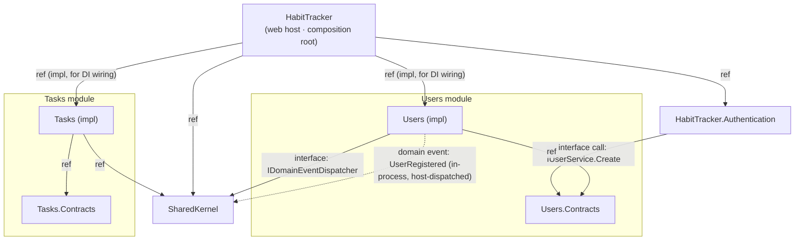

# Module dependency diagram

The coupling between projects, with **how** each edge communicates. Treat an unreviewed change
to this diagram like a schema migration: a new edge is a new coupling and needs an ADR.

## Edge legend

| From → To | Mechanism | Notes |
|-----------|-----------|-------|
| Host → Users (impl) | `ProjectReference` | Host references impl **only** to call `AddUsersModule` for DI wiring. It still talks to the module through `IUserService`. |
| Host → Tasks (impl) | `ProjectReference` | Same — for `AddTasksModule` + endpoint wiring against `ITaskService`. |
| Host → Authentication | `ProjectReference` | `AddOidcAuthentication`, `MapAuthEndpoints`. |
| Host → SharedKernel | `ProjectReference` | Host implements `IDomainEventDispatcher` (`Infrastructure/DomainEventDispatcher.cs`). |
| **Authentication → Users.Contracts** | **Interface injection** (`IUserService.Create`) | The one cross-component call into a module. Contracts-only. → [auth-to-users.md](integrations/auth-to-users.md) |
| Users (impl) → Users.Contracts | `ProjectReference` | A module references its own Contracts. |
| Users (impl) → SharedKernel | Interface (`IDomainEventDispatcher`) | Publishes `UserRegistered`. |
| Tasks (impl) → Tasks.Contracts | `ProjectReference` | Its own Contracts. |
| Tasks (impl) → SharedKernel | `ProjectReference` | Present per template; no events used yet. |
| Users (impl) ⇢ SharedKernel (dotted) | **Domain event**, in-process | `UserRegistered` dispatched by the host's `DomainEventDispatcher` after `SaveChangesAsync`. **No subscriber today.** → [user-registered-event.md](integrations/user-registered-event.md) |

## Anti-corruption / adapters

- **`ClaimsPrincipalExtensions.GetUserId()`** (`HabitTracker/Infrastructure/`) adapts an authenticated
  `ClaimsPrincipal` (the `uid` claim) into the bare `Guid ownerId` that `ITaskService` expects.
  This is the seam that keeps Tasks ignorant of identity/auth — see [ADR-0005](adr/0005-tasks-uses-opaque-ownerid.md).

## What is deliberately absent

- **No Users ⇄ Tasks edge.** The modules are fully decoupled. If Tasks ever needs to validate or
  react to users, the intended path is the `UserRegistered` domain event or an `IUserService`
  call through Contracts — never an impl reference. Record the choice as an ADR first.
