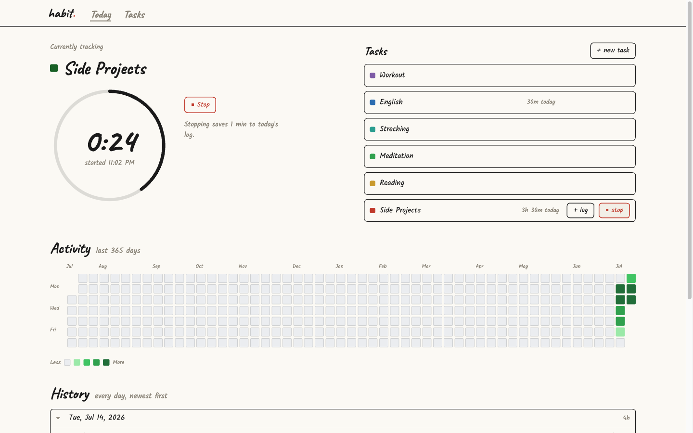
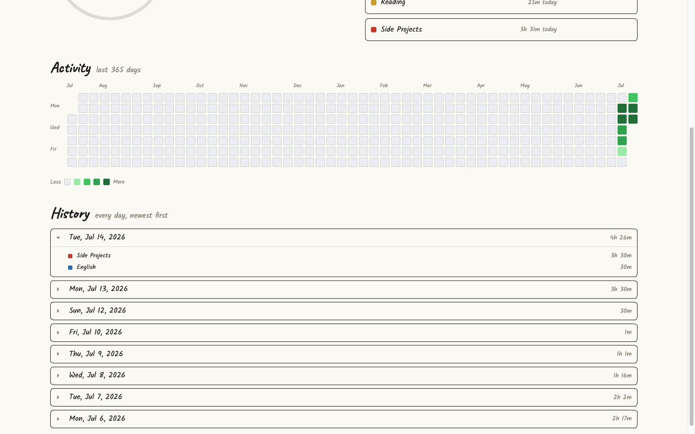
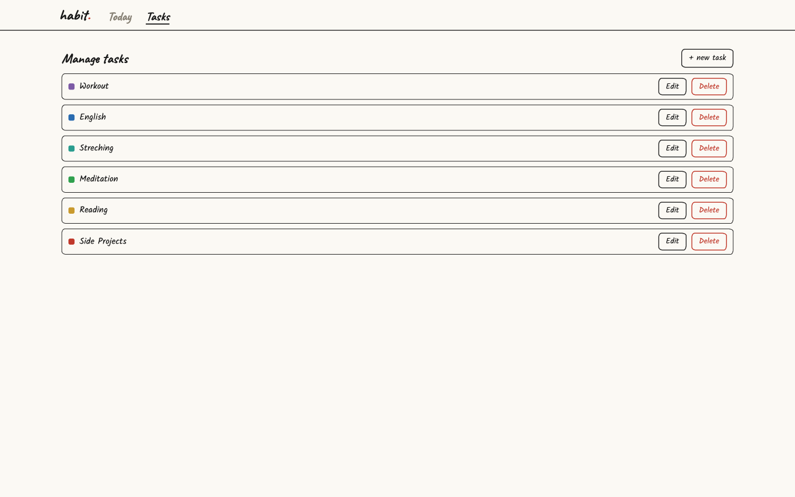
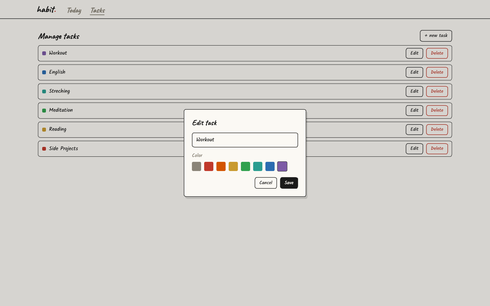
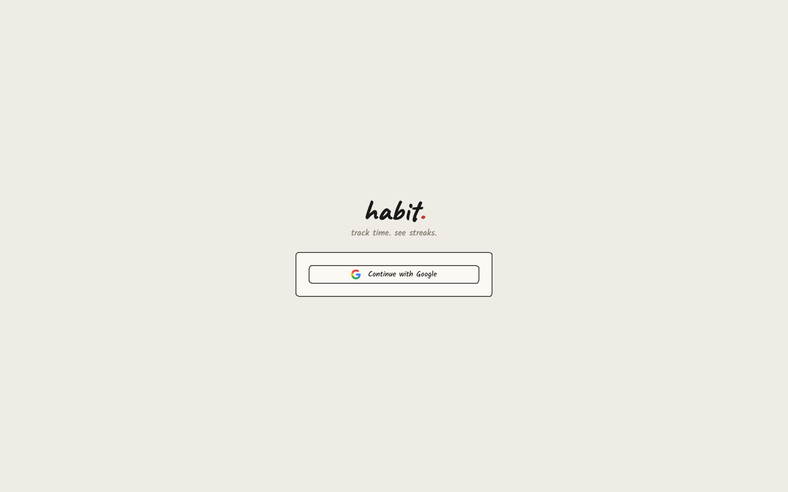

# habit.

> track time. see streaks.

A time-tracking habit tracker: log time against your tasks — with a built-in timer or by hand — and watch your consistency build up on a GitHub-style activity heatmap.

**Live demo:** https://bill219-8080.mikrus.cloud/

---

## Screenshots

### Dashboard — track time as you go

Start a timer from any task and watch the ring tick up, or log minutes by hand. Per-task colors carry through the whole app.



### Activity & history

A 365-day heatmap of daily totals, plus a day-by-day history you can expand into a per-task breakdown.



### Manage tasks

Create, rename, recolor, and delete your tasks.





### Sign in

Cookie-based, same-origin auth via Google (OIDC).



---

## Features

- **Built-in timer** — a client-side stopwatch (persisted in `localStorage`, synced across tabs) that rounds up to whole minutes and posts a time log on stop.
- **Manual logging** — add time entries against any task by hand.
- **Activity heatmap** — per-day totals for the last 365 days, rendered server-side.
- **Daily history** — every day newest-first, each expandable into its per-task breakdown.
- **Per-task colors** — a bounded palette carried on every task.
- **Google sign-in** — OIDC authorization-code flow, cookie auth, register-on-first-login.

## Tech stack

- **Backend** — .NET 10 modular monolith (ASP.NET Core minimal APIs), EF Core + PostgreSQL, xUnit integration tests against a real Postgres via Testcontainers.
- **Frontend** — Angular 21 standalone-component SPA (signals throughout, OnPush change detection), Tailwind CSS v4, Vitest.
- **Auth** — OIDC (Google) + cookie auth, same-origin (no CORS, no tokens).

## Architecture

Modular monolith. Each business capability is a self-contained **module** (`Modules/<Name>/`) split into an internal implementation project and a public **Contracts** project — the only surface other modules may reference. Each module owns its own `DbContext` and a dedicated Postgres schema. HTTP endpoints live in the host, not the modules; cross-module reactions go through in-process domain events.

Current modules:

- **Users** — provisioned from OIDC claims on login.
- **Tasks** — tasks, manual time logs, and server-side rollups (year aggregates for the heatmap, per-day breakdowns). Owns work by an opaque `ownerId`, with no dependency on the Users module.

Architecture decisions are recorded in [`HabitTracker/Docs/Adr/`](HabitTracker/Docs/Adr/).

## Getting started

```bash
# Backend (.NET 10) — API on https :7252 / http :5297
dotnet run --project HabitTracker

# Frontend (Angular 21) — from frontend/, ng serve on :4200, proxies /api to :8080
cd frontend && npm start

# Full stack via Docker — app on :8080, postgres 17 on :5432
docker compose up

# Tests
dotnet test              # backend integration tests (Docker must be running)
cd frontend && npm test  # frontend unit tests
```

See [`CLAUDE.md`](CLAUDE.md) for the full command reference and conventions.
