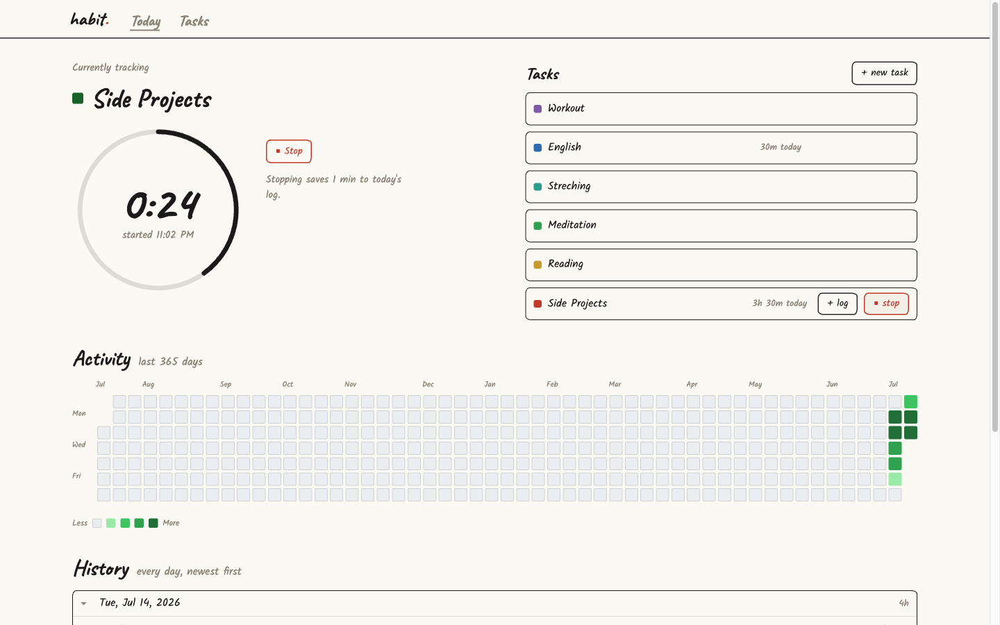
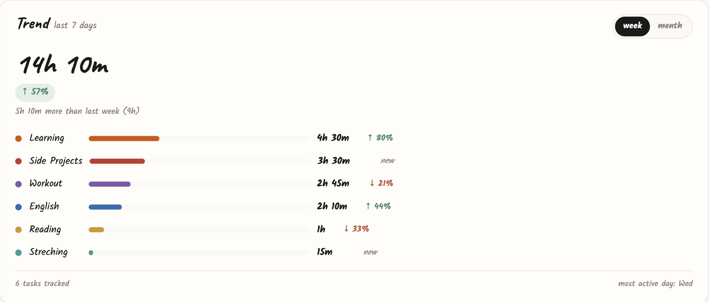
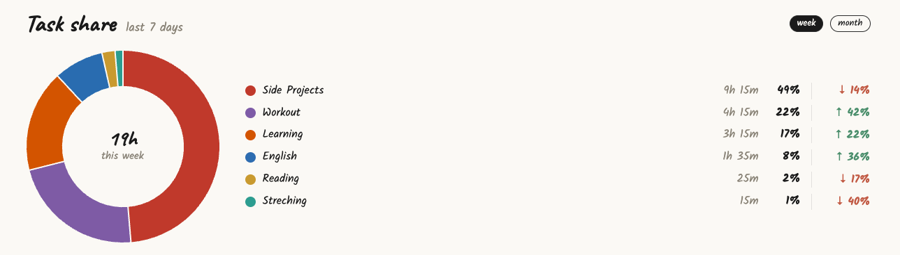
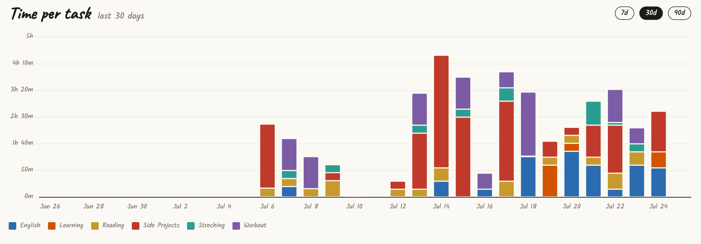
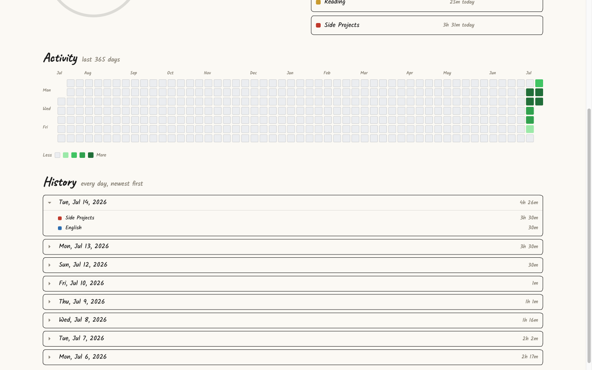
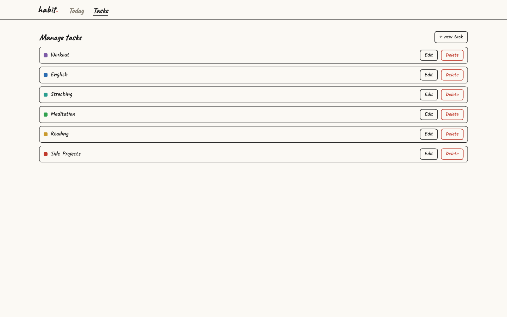
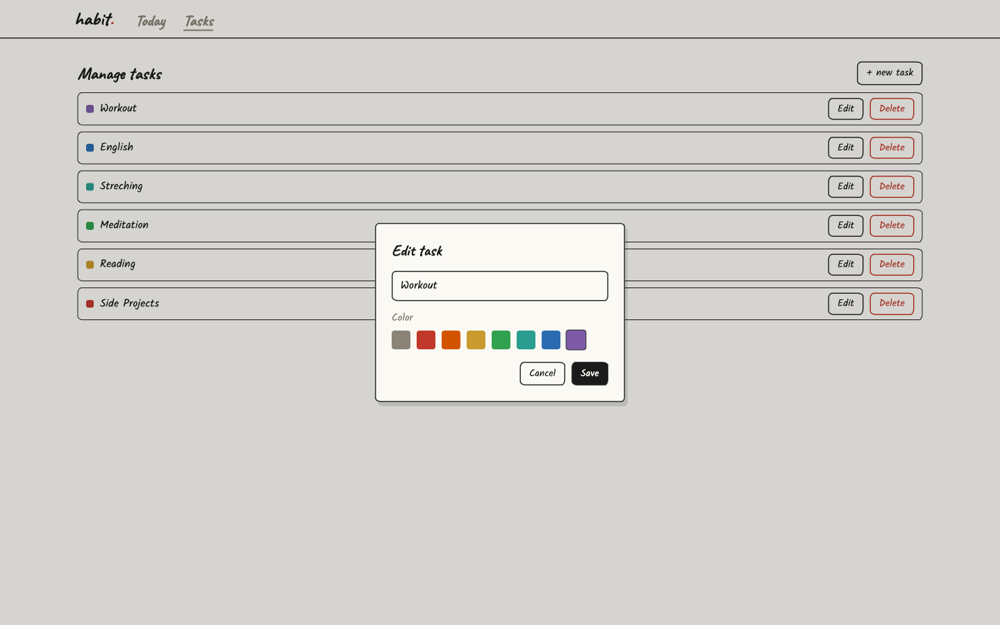
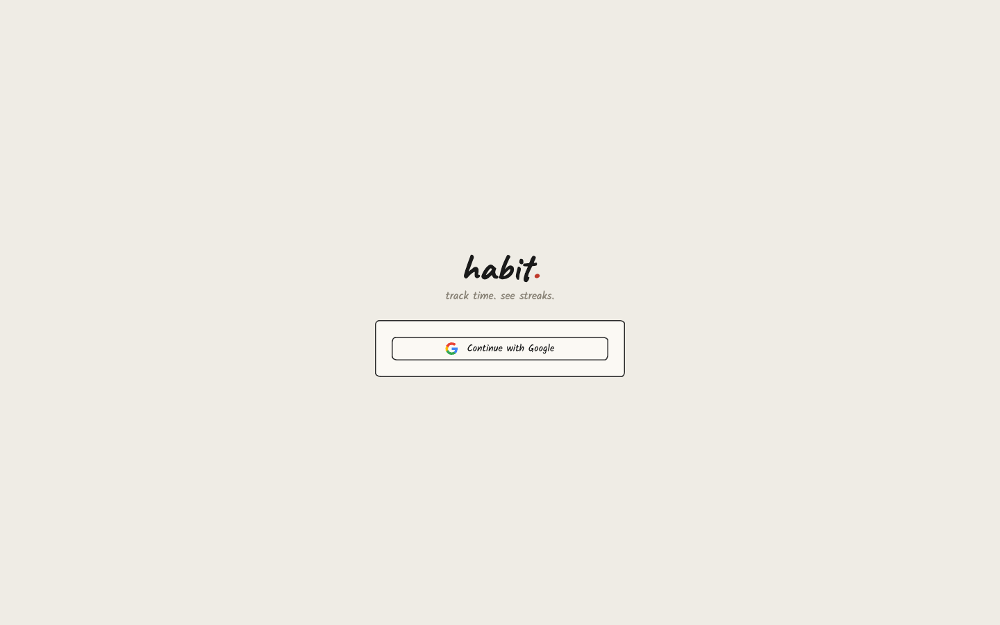
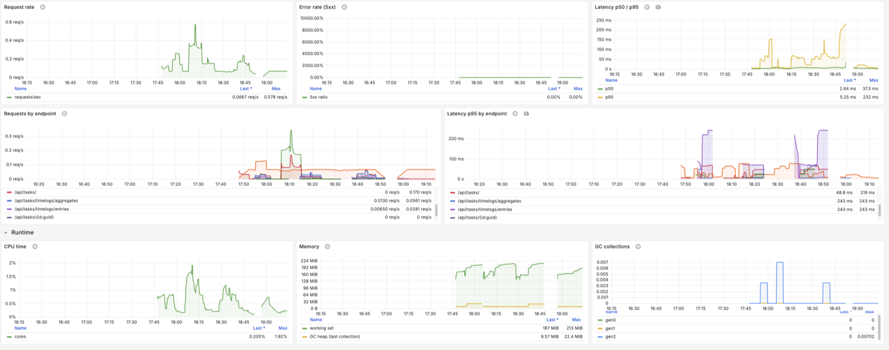

# habit.

> track time. see streaks.

A time-tracking habit tracker: log time against your tasks — with a built-in timer or by hand — and watch your consistency build up on a GitHub-style activity heatmap.

**Live demo:** https://bill219-8080.mikrus.cloud/

---

## Screenshots

### Dashboard — track time as you go

Start a timer from any task and watch the ring tick up, or log minutes by hand. Per-task colors carry through the whole app.



### Trend — this week vs. last

Total time in the last 7 (or 30) days against the window right before it, with the percentage swing, plus a per-task ranking showing each task's share and its own change — `new` where there's no baseline to compare against.



### Task share

A donut chart of how your time splits across tasks over the last week or month, with the window's total in the middle and a name / duration / share breakdown beside it.



### Time per task

A stacked bar chart of daily time broken down per task, switchable between 7 / 30 / 90-day ranges.



### Activity & history

A 365-day heatmap of daily totals, plus a day-by-day timeline of every logged entry.



### Manage tasks

Create, rename, recolor, and delete your tasks.





### Sign in

Cookie-based, same-origin auth via Google (OIDC).



---

## Features

- **Built-in timer** — a client-side stopwatch (persisted in `localStorage`, synced across tabs) that rounds up to whole minutes and posts a time log on stop.
- **Manual logging** — add time entries against any task by hand.
- **Trend comparison** — the last 7 or 30 days measured against the preceding window, overall and per task, with the busiest weekday.
- **Task-share donut** — a Chart.js doughnut of each task's share of your time over the last week or month, with per-task durations and percentages.
- **Time-per-task chart** — stacked daily bars (Chart.js) of time per task, over the last 7 / 30 / 90 days.
- **Activity heatmap** — per-day totals for the last 365 days, rendered server-side.
- **Daily history** — a timeline of every logged entry, grouped by day newest-first with per-day totals.
- **Per-task colors** — a bounded palette carried on every task.
- **Google sign-in** — OIDC authorization-code flow, cookie auth, register-on-first-login.

## Tech stack

- **Backend** — .NET 10 modular monolith (ASP.NET Core minimal APIs), EF Core + PostgreSQL, xUnit integration tests against a real Postgres via Testcontainers.
- **Frontend** — Angular 21 standalone-component SPA (signals throughout, OnPush change detection), Tailwind CSS v4, Vitest.
- **Auth** — OIDC (Google) + cookie auth, same-origin (no CORS, no tokens).
- **Observability** — OpenTelemetry metrics (ASP.NET Core, runtime, EF Core, custom business counters) → Prometheus → Grafana.

## Architecture

Modular monolith. Each business capability is a self-contained **module** (`Modules/<Name>/`) split into an internal implementation project and a public **Contracts** project — the only surface other modules may reference. Each module owns its own `DbContext` and a dedicated Postgres schema. HTTP endpoints live in the host, not the modules; cross-module reactions go through in-process domain events.

Current modules:

- **Users** — provisioned from OIDC claims on login.
- **Tasks** — tasks, manual time logs, and server-side rollups (year aggregates for the heatmap, per-day breakdowns). Owns work by an opaque `ownerId`, with no dependency on the Users module.

Architecture decisions are recorded in [`HabitTracker/Docs/Adr/`](HabitTracker/Docs/Adr/).

## Observability

HabitTracker is instrumented with **OpenTelemetry** and ships a full local metrics stack.

- **ASP.NET Core** — request rate, error rate, latency histograms, per-route breakdown.
- **.NET runtime** — GC, CPU, threadpool, memory.
- **EF Core / Npgsql** — database command duration.
- **Custom business metrics** — `habittracker_tasks_created_total`, `habittracker_time_logs_created_total`, `habittracker_tracked_minutes_total` and friends, recorded inside the Tasks module so they follow domain operations rather than HTTP calls.

Metrics are exposed in Prometheus format at `/api/metrics` (unauthenticated — fine for a local compose stack, put it behind network policy before exposing the app publicly), scraped by **Prometheus**, and visualized in **Grafana** — datasource and dashboard are provisioned from [`observability/`](observability/), so `docker compose up` brings the whole stack up ready to use.

| Service | URL |
|---|---|
| App | http://localhost:8080 |
| Prometheus | http://localhost:9090 |
| Grafana | http://localhost:3000 (anonymous viewer; admin/admin to edit) |

Those ports and the open Grafana are the **local** stack only — see [Deployment](#deployment) for how the same stack is locked down on a server.



## Getting started

```bash
# Backend (.NET 10) — API on https :7252 / http :5297
dotnet run --project HabitTracker

# Frontend (Angular 21) — from frontend/, ng serve on :4200, proxies /api to :8080
cd frontend && npm start

# Full stack via Docker — app :8080, postgres :5432, prometheus :9090, grafana :3000
docker compose up

# Tests
dotnet test              # backend integration tests (Docker must be running)
cd frontend && npm test  # frontend unit tests
```


## Deployment

Push to `main` and [`.github/workflows/deploy.yml`](.github/workflows/deploy.yml) does the rest:
backend + frontend tests → build and push the image to Docker Hub (tagged `latest` and the
commit SHA) → deploy over SSH.

The server runs the stack from [`compose.prod.yaml`](compose.prod.yaml), which differs from the
local `compose.yaml` in three ways:

- **The image is pulled, not built** — tagged with the exact commit that CI built.
- **Postgres is external.** The app talks to a managed database; connection strings come from
  `/opt/habit/.env` on the server, which is never in this repo.
- **Prometheus is internal, Grafana is public.** Prometheus publishes no ports, because
  `/api/metrics` is unauthenticated and only Prometheus should reach it. Grafana is exposed,
  so anonymous access is off and its admin password is required from `.env`.

### Server prerequisites

`/opt/habit/.env` must exist before the first deploy, holding at least:

```dotenv
ConnectionStrings__Users=Host=...;Database=...;Username=...;Password=...
ConnectionStrings__Tasks=Host=...;Database=...;Username=...;Password=...
Oidc__ClientId=...
Oidc__ClientSecret=...
GRAFANA_ADMIN_PASSWORD=...        # required — Grafana is internet-facing
GRAFANA_ROOT_URL=https://...      # optional, if Grafana sits behind a domain/proxy
```

Repository secrets used by the workflow: `DOCKERHUB_USERNAME`, `DOCKERHUB_TOKEN`, `VPS_HOST`,
`VPS_USER`, `VPS_SSH_KEY`, and optionally `VPS_PORT`.

### Rolling back

Every deploy is pinned to a commit SHA, so redeploying an older one is a single command on the
server:

```bash
cd /opt/habit
IMAGE=<dockerhub-user>/habit IMAGE_TAG=<previous-sha> docker compose -f compose.prod.yaml up -d
```

See [`CLAUDE.md`](CLAUDE.md) for the full command reference and conventions.
